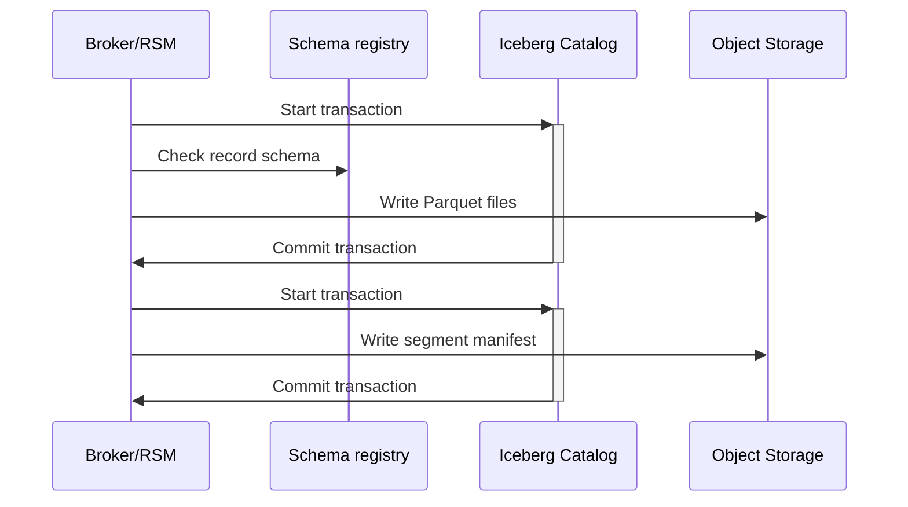
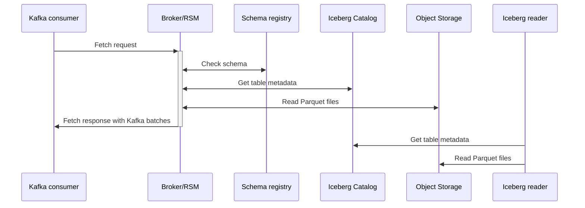

# Iceberg Topics for Apache Kafka
Written by: Ivan Yurchenko, Anatolii Popov, Filip Yonov 

[Discussion](https://github.com/Aiven-Open/tiered-storage-for-apache-kafka/discussions/717).

## Background

Apache Kafka has become the standard substrate for building streaming applications. In parallel, Apache Iceberg has emerged as the de-facto open table format for data lake workloads, providing a well-specified metadata model, atomic commits, hidden partitioning, and safe schema evolution across a broad set of query engines.

Most Kafka deployments now run on hyperscale clouds where durable, high-availability object storage is both ubiquitous and cost-effective. Kafka's Tiered Storage ([KIP-405](https://cwiki.apache.org/confluence/display/KAFKA/KIP-405%3A+Kafka+Tiered+Storage)) takes advantage of this by placing inactive log segments in object storage and is widely adopted. However, Tiered Storage by itself does not produce Iceberg tables. Organizations that want Kafka topics to be queryable as Iceberg must introduce an additional bridge—typically a connector process or a proprietary broker-adjacent feature—to copy and rewrite the same bytes into Iceberg. This indirection has well-known consequences: duplicate storage of identical data, additional cross-AZ transfer and request costs, extra systems to operate, and a lag window between the log and the table.

Several Kafka-compatible offerings reduce some of this burden by emitting Iceberg files under their own control plane and catalog. **Crucially, open-source Apache Kafka has no native, upstream path to land topics directly in Iceberg**—users must either run a connector pipeline or adopt a proprietary bridge. Both choices couple the pipeline to an external system, reduce portability, and fragment governance.

A broker-native path fixes this. Kafka's `RemoteStorageManager` (RSM) runs in the broker context and already mediates segment upload and fetch for tiered topics. If, when a segment rotates, the RSM were able to persist records directly as Parquet files into an Iceberg table—and on fetch, reconstruct valid Kafka batches from those same files—the system would maintain **one durable copy** that serves two views: Kafka replay and Iceberg analytics. Schema materialization can be derived from Avro values registered in a schema registry, while keys remain opaque bytes to preserve partitioning semantics. From the broker's perspective, correctness (no loss/duplication) is preserved; Iceberg readers gain immediate access to spec-compliant tables without a second pipeline.

This whitepaper describes **Apache Iceberg on Apache Kafka**: an Iceberg-aware RSM that makes Iceberg tables the remote representation of tiered Kafka topics, eliminating the connector hop and the second copy while remaining catalog- and object-store-agnostic.

## Motivating Question

**Should Kafka natively write tiered segments to Iceberg so a topic is a table—no connector, no second copy?**

**Yes.** Extending the broker's RSM to write inactive segments directly into Iceberg—and to reconstruct Kafka batches from those same files on fetch—preserves Kafka's correctness guarantees while collapsing operational complexity and cost. It aligns with the industry's move to object-store-centric architectures, leverages Iceberg's open specification and ecosystem, and maintains portability by remaining catalog-agnostic and schema-registry-compatible.

## New Capabilities

Data lake-native streaming makes a Kafka topic readable as an Iceberg table on object storage—zero-ETL, zero-copy. Reads scale with files/splits rather than partitions, giving batch/ETL/ML jobs near object-store throughput. Clients operate with table semantics (snapshots, predicate pushdown, projection) instead of the Kafka consumer protocol—no consumer groups, rebalances, or offset commits to manage. Data services read tables, not logs: engines such as Spark/Trino/Flink plan over Iceberg splits, so parallelism is independent of Kafka's partition count. Teams query with SQL or a minimal HTTP/SDK, can build a reader in hours, and run backfills on deterministic snapshots. The Kafka partition and offset remain as columns for lineage and filtering. Thus the onboarding time is reduced, operational sharp edges are removed, and object store-level throughput is unlocked.

The result is simpler pipelines, massive parallelism, and no duplicate storage or connector fleets, while brokers still reconstruct valid Kafka batches for replay; in most analytical and ETL use cases, Kafka consumers can be replaced with table reads using standard data lake semantics.

### For Apache Kafka operators

- **Single copy.** Tiered segments stored as Iceberg/Parquet and reused for broker fetch.
- **No Sink Connectors.** Remove sidecars, flush tuning, extra failure modes.
- **Lower cloud spend.** No duplicate storage/transfer/request amplification.
- **Bring your own catalog and bucket.** REST/JDBC/Hadoop catalogs; S3-compatible stores.
- **Mixed mode.** Classic and Iceberg segments in one topic.
- **Freshness knobs.** Commit on when a segment rotates.
- **No client changes.** Producers/consumers are unchanged.

### For data and analytics teams

- **SQL on topics.** Query the same bytes as an Iceberg table (Trino/Spark/Flink).
- **Scale beyond partitions.** Parallelism from splits/files, not partition count.
- **Snapshots and time travel.** Deterministic backfills and audits.
- **Lineage and deduplication.** `kafka.partition` and `kafka.offset` columns enable simple deduplication and joins.
- **Governed retention.** Kafka deletes hide from the log; Iceberg can retain it for analytics.

### For the ecosystem
- **Open and portable.** Confluent Schema Registry-compatible Avro→Iceberg; Iceberg catalog-agnostic.
- **Upstream path.** Built on RSM, schema evolution, transactions—without lock-in.

**Result:** one durable copy, two first-class views—**Kafka for replay, Iceberg for analytics**—with lower cost, higher simplicity, and immediate fit into the open data lakehouse toolchain.

## How it works

Aiven pioneered the tiered storage implementation and now it is in production across some of the largest Kafka fleets in the world. Now we extend the RSM so that segments are persisted as Iceberg/Parquet, and on fetching the RSM reconstructs valid Kafka batches from those files. The system maintains one copy of data in object storage that serves two views: Kafka replay and Iceberg analytics.

- **Broker-side:** The RSM runs in the broker, invoked on segment copy/fetch/delete. When a segment is rotated and copied, it validates Avro values via the schema registry, materializes Kafka records into Parquet, and writes to the corresponding Iceberg table. On fetch, it reads Parquet files referenced by a segment manifest (not to be confused with Iceberg manifests) and reconstructs Kafka record batches, preserving batch boundaries and start positions.
- **Data model:** Values are Avro-derived Iceberg rows. Each row carries `kafka.partition`, `kafka.offset`, `timestamp`, `headers`, `kafka.batch_byte_offset`, `kafka.batch_partition_leader_epoch` and other fields for lineage and reconstruction. The `value_raw` field stores unparseable values. Keys remain opaque bytes, because normally it's not recommended to put Avro records there to not break the Kafka partitioning semantics.
- **Coexistence:** Classic (non-Iceberg) and Iceberg segments can coexist in one topic. The segment manifest identifies segment type and file mapping; brokers fetch transparently.
- **Portability:** Works with REST, JDBC, Hadoop and other catalogs and S3-compatible object storage.

The plugin is responsible for the following:
- Parse segments as Avro records and validate values against the schema registry.
- Create the target Iceberg table if absent.
- Transform Avro values to Iceberg rows and append to Parquet files.
- On fetch, read the referenced Parquet files, transform back to Avro, and pack records into Kafka batches.

The plugin is not responsible for other operations on Iceberg schemas such as compaction and snapshot expirations. These operations performed by third party tools aren't supported at the moment (see [Upcoming work](#upcoming-work).)

The solution guarantees that records are never lost or duplicated from the perspective of Kafka brokers. In the worst case scenario, when the record value cannot be parsed or is simply malformed, brokers are still able to read it as if it was in a normal segment file (using the `value_raw` field).

After Kafka deletes remote data due to expiration or an API call, the data become unavailable to Kafka consumers, but still is available to the Iceberg readers.

### Requirements and external dependencies

Apache Kafka doesn't have native support for data structure and schemas: data are just bytes for Kafka. However, structured data is dominant in the industry. Apache Avro as the binary serialization format is particularly widely used. Our solution requires record values to be valid Avro values, including primitives, to be able to meaningfully convert them into Iceberg table rows. In contrast to values, record keys are not parsed and are stored as byte arrays. The reason behind this is that it's not recommended to encode record keys with Avro in order to be on the safe side with the byte-level equality for key-based partitioning.

Schema registry is a commonly used component that allows storing schemas and managing their evolution with the desired degree of compatibility. Implementing data lake tables requires schema registry as the storage for Avro schemas and, in the future, as the gatekeeper for schema evolution. There are several open source and proprietary implementations of schema registry. Any of them can be used provided their protocol is compatible with Confluent Schema Registry.

The Iceberg catalog is essential to manage Iceberg tables. It allows managing table schemas, evolving them, and appending data. There are several Iceberg catalog implementations: REST, JDBC, Hadoop, etc. Our solution is catalog-agnostic and supports any of them.

An object storage is required to store the actual data and Iceberg metadata. We implemented the support for AWS S3 (and compatible) as the object storage, however other storages will be added later (see [Upcoming work](#upcoming-work)).

### Table schema

Table rows have the following structure:
- `kafka` - contains Kafka record metadata:
  - `partition` (`int`) - the record partition.
  - `offset` (`long`) - the record offset.
  - `timestamp` (`timestamptz`) - the record timestamp.
  - The information about the original batch the record belonged too:
    - `batch_byte_offset` (`int`) - the byte offset of the batch within the segment file.
    - `batch_base_offset` (`long`) - the base offset of the batch.
    - `batch_partition_leader_epoch` (`int`) - the partition leader epoch.
    - `batch_magic` (`int`) - the magic number.
    - `batch_timestamp_type` (`int`) - the ID of the timestamp type (according to Kafka's `TimestampType`).
    - `batch_compression_type` (`int`) - the ID of the compression type (according to Kafka's `Compression`).
    - `batch_max_timestamp` (`long`) - the max timestamp of the batch.
    - `batch_producer_id` (`long`) - the producer ID.
    - `batch_producer_epoch` (`int`) - the producer epoch.
    - `batch_base_sequence` (`int`) - the base sequence.
  - `headers` (`list`) - the of key-value pairs of record headers:
    - `key` (`string`) - the key.
    - `value` (`binary`) - the value.
  - `key_raw` (`binary`) - the record key, as an opaque byte array.
  - `value` (`struct`) - the record value, laid out according to the schema. The field is optional, because it's not filled when there's a parsing error or when the record value is itself `null`.
  - `value_raw` (`binary`) - the record value as optional binary. Filled only when the value can't be parsed onto structure and is not `null` itself.

The table is partitioned by the day of `timestamp`.

### Remote file structure

For each segment uploaded by the broker, the RSM plugin creates one or more Parquet data files. There may be more than one data file because of partitioning and, in the future, schema evolution.

The plugin also creates the segment manifest file (not to be confused with Iceberg manifests). The segment manifest resembles the one from the classic Kafka mode of the RSM plugin, but with several differences:
1. It's not in the JSON format, but in [Puffin](https://iceberg.apache.org/puffin-spec/). The rationale for this is that Puffin is purposefully designed as the metadata format for Iceberg. Puffin files can be referred to by snapshots, which prevent their deletion by third party tools.
2. It contains the Kafka segment index data in itself in contrast to separate files in the classic Kafka mode. It was done this way because Puffin is good for storing binary data.
3. It has a slightly different set of fields. For example, in the Iceberg mode there's no chunking like in the Kafka mode, so the chunk index is not needed.

The name of the segment file is deterministic so that it's always possible to locate it based on the broker request.

### Writing

Our solution, being a Kafka RSM plugin, writes data to an Iceberg table when the partition leader initiates copying a log segment. As it's the case with any other Kafka RSM plugins, data are uploaded by the broker when a segment is closed and rotated.

First, the RSM plugin checks the configuration: should its segments be stored as normal Kafka segments or be written to an Iceberg table.

If Iceberg is required, a transaction on the catalog is started. Iceberg transactions are optimistic, so they don't prevent each other from proceeding, but they may fail when a commit attempt is made. The plugin writes to the default `main` branch of a table.

RSM reads the provided log segment, unpacks record batches, and inspects individual records. For each record:
1. It checks the value against its schema. If it's impossible to deserialize the value using the provided schema, the error fallback mechanism is used (described below).
2. Based on the Avro schema, the corresponding Iceberg schema is created.
3. If the table doesn't exist, it's created with the Iceberg schema. Schema evolution is not performed at the moment.
4. The record is appended to the Parquet file.

As files are partitioned by the day of the timestamp, it's possible that more than one data file will be used per segment. The list of the files with the associated Kafka and byte offsets are included in the segment manifest.

Then, the Iceberg transaction is attempted to be committed. The commit may fail due to conflict. In this case, the procedure is reattempted.

After the Iceberg transaction is committed, another transaction is started to upload the segment manifest, which refers to the result snapshot of the previous transaction. Unfortunately, Iceberg [cannot](https://github.com/apache/iceberg/issues/6442) do this atomically at the moment.

Topics may contain multiple partitions. In this case, their segments may be uploaded concurrently by their leaders. As Kafka doesn't establish an order on records across multiple partitions of one topic, neither do we. Segments for different partitions are appended to Iceberg concurrently.

Sometimes it's not possible to convert a record value into Iceberg/Parquet. There may be multiple reasons: the schema may be incompatible, or the value may be corrupted or not be Avro at all. For this, there is a fallback mechanism. The value of such records are stored as raw bytes in the special field `value_raw`. They are effectively useless for Iceberg readers, but at least they aren't lost to Kafka consumers.



#### Current limitations

There are circumstances where the same offset may be uploaded multiple times in different segment files. For example, when the partition leader changes with unfortunate timing or an unclean leader election with truncation happens. The write workflow is also not transactional end-to-end. For example, if the Iceberg transaction commits successfully but the remote log metadata persistence fails on the broker side, the broker will eventually re-attempt the uploading. On the next attempt, the data will be uploaded and committed again, thus creating duplicates in the Iceberg table. Kafka brokers have a sophisticated remote log metadata mechanism that allows them to resolve these inconsistencies. Our RSM plugin is compatible with it. However, the plugin doesn't prevent duplicates from being visible to Iceberg readers. It's possible to deduplicate records on the Iceberg reader side. This limitation will be addressed in the future (see [Upcoming work](#upcoming-work)).

Schema evolution is not supported at the moment. The schema of the first record in the topic that the plugin encounters sets the schema of the whole table “forever”. Acknowledging that schema evolution is crucial for most production setups, we're adding it shortly (see [Upcoming work](#upcoming-work)).

Kafka transactions are also not supported for now. If a transaction control batch is encountered, the whole segment cannot be uploaded. The support for transactional data will be added later (see [Upcoming work](#upcoming-work)).

### Reading

If the segment is Iceberg, we need to know all the Parquet files involved. We get this information from the segment manifest.

When the `fetchLogSegment` method of `RemoteStorageManager` is called by the broker, the broker expects back an `InputStream` of valid Kafka batches, where the `startPosition` (the byte position in the original file) is included. The batch split doesn't have to be the same as in the original uploaded segment file nor does it have to be consistent across method calls. The task of the RSM plugin during fetching is to revert the writing procedure. Particularly, the plugin tries to restore the original Kafka record batches as close as possible.

The `startPosition` passed to `fetchLogSegment` indicates the byte offset from which batches must be returned. It's expected to correspond to a batch border in the original segment file. Based on this:
1. The segment may be written in multiple Parquet files (e.g. due to Iceberg partitioning). Using the segment manifest, we can find the first file that contains the first requested batch. We will read on from this file.
2. Filter the file to include only records with `batch_byte_offset` equals or greater than `startPosition`.
3. Records are read and combined into batches in memory. The `batch_byte_offset` field hints when the batch from which the record came changes. This can be used to draw borders between batches as we recreate them.

During writing, a record may happen to be corrupted or just not compatible with the table schema-wise. In this case its value is written as bytes into `value_raw`. If `value_raw` is not `null`, then it's returned instead of serializing value.




### Deletion

When a broker deletes a remote segment, the plugin makes it unavailable to Kafka for further reads. However, the corresponding Parquet file is not deleted from the Iceberg table, thus keeping the data available to Iceberg clients.

When a broker deletes the whole topic, the RSM plugin doesn't have information about that. For it, it's just a series of segment deletions. Due to this, the corresponding Iceberg table is not deleted when a topic is deleted.

## Configuration

These settings need to be added to the broker configuration file:

```
# Enable remote storage
remote.log.storage.system.enable=true
# Enable Aiven RSM plugin
remote.log.storage.manager.class.name=io.aiven.kafka.tieredstorage.RemoteStorageManager
# Use Iceberg
rsm.config.segment.format=iceberg
# Structure provider, responsible for serialization and deserialization,
# and for schemas.
rsm.config.structure.provider.class=io.aiven.kafka.tieredstorage.iceberg.AvroSchemaRegistryStructureProvider
# Schema registry address
rsm.config.structure.provider.serde.schema.registry.url=http://karapace:8081
# Iceberg settings
rsm.config.iceberg.namespace=default
# Catalog (use the different implementation and settings if needed)
rsm.config.iceberg.catalog.class=org.apache.iceberg.rest.RESTCatalog
rsm.config.iceberg.catalog.uri=http://rest:8181
# Object storage
rsm.config.iceberg.catalog.io-impl=org.apache.iceberg.aws.s3.S3FileIO
rsm.config.iceberg.catalog.warehouse=s3://warehouse/
rsm.config.iceberg.catalog.s3.endpoint=http://minio:9000
rsm.config.iceberg.catalog.s3.access-key-id=admin
rsm.config.iceberg.catalog.s3.secret-access-key=password
rsm.config.iceberg.catalog.client.region=us-east-2
```

At the moment, Kafka doesn't allow RSM-specific per-topic configuration, and it doesn't inform RSM plugins about current topic configuration as well. This effectively prevents per-topic fine-tuning of the Iceberg features. We plan to address this issue in the future.

## Upcoming Work 

Below is our roadmap that will seek to address production-related features, this is live document, and we will continually update progress: 

- Implement schema evolution.
- Add support for GCS and Azure Blob Storage.
- Make the solution more robust to uploading an offset multiple times. For example, Kafka readers don't experience duplicates in such cases, so the Iceberg readers should not as well.
- Support transactional data in Kafka segments.
- Support table compaction, snapshot expiration, and other external operations on Iceberg tables.
- Support Apache Avro and ORC as storage formats.
- Support JSON and Protobuf as record formats.
- Support other table formats like Delta Lake.
- Implement caching for faster reads.
- Support Parquet encryption.
- Perform a full scale benchmark and resource usage analysis.
- Remove dependency on the catalog for reading.
- Reshape the subproject structure to allow installations to be more compact if the Iceberg support is not needed.
